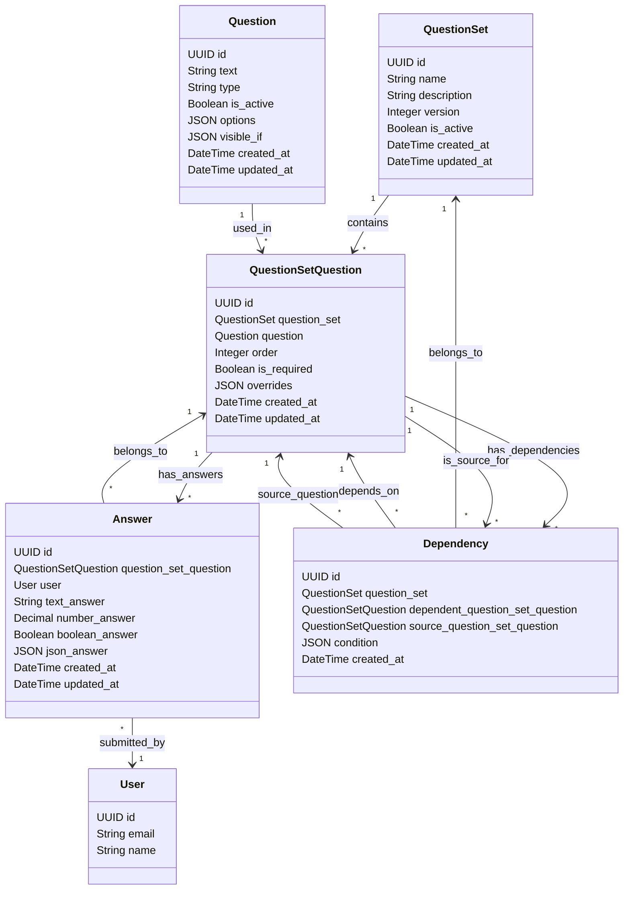

```mermaid
classDiagram
    class QuestionSet {
        UUID id
        String name
        String description
        Integer version
        Boolean is_active
        DateTime created_at
        DateTime updated_at
    }

    class Question {
        UUID id
        String text
        String type
        Boolean is_active
        JSON options
        JSON visible_if
        DateTime created_at
        DateTime updated_at
    }

    class QuestionSetQuestion {
        UUID id
        QuestionSet question_set
        Question question
        Integer order
        Boolean is_required
        JSON overrides
        DateTime created_at
        DateTime updated_at
    }

    class Answer {
        UUID id
        QuestionSetQuestion question_set_question
        User user
        String text_answer
        Decimal number_answer
        Boolean boolean_answer
        JSON json_answer
        DateTime created_at
        DateTime updated_at
    }

    class Dependency {
        UUID id
        QuestionSet question_set
        QuestionSetQuestion dependent_question_set_question
        QuestionSetQuestion source_question_set_question
        JSON condition
        DateTime created_at
    }

    class User {
        UUID id
        String email
        String name
    }

    %% Relationships
    QuestionSet "1" --> "*" QuestionSetQuestion : contains
    Question "1" --> "*" QuestionSetQuestion : used_in
    QuestionSetQuestion "1" --> "*" Answer : has_answers
    QuestionSetQuestion "1" --> "*" Dependency : has_dependencies
    QuestionSetQuestion "1" --> "*" Dependency : is_source_for
    Answer "*" --> "1" User : submitted_by
    Answer "*" --> "1" QuestionSetQuestion : belongs_to
    Dependency "*" --> "1" QuestionSet : belongs_to
    Dependency "*" --> "1" QuestionSetQuestion : depends_on
    Dependency "*" --> "1" QuestionSetQuestion : source_question
```